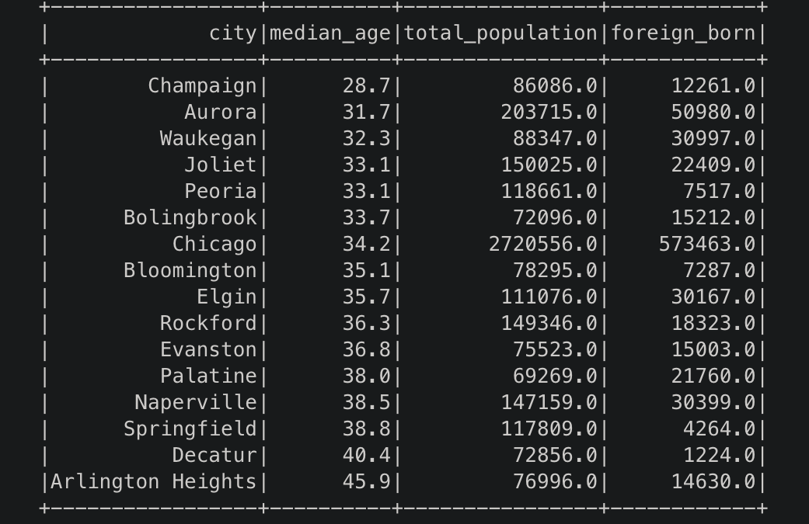
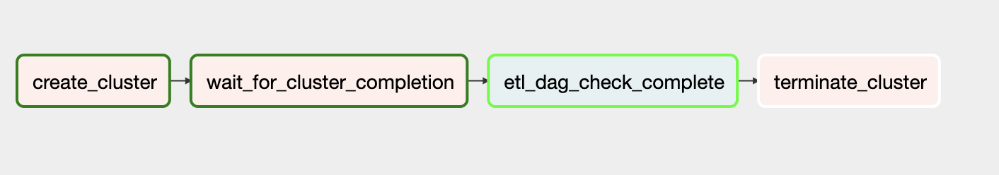

## Capstone Project

  This repo is for the final project in the data engineering nano degree for Udacity. This repo is the culmination of what we have learned during the course. I am choosing to complete the project with the data that is being provided by Udacity.

## Project Parameters

  This project is based on the assumption that this data would be inserted into an s3 bucket at regular intervals/real time.

## Project Goals

  I will build a data lake on s3 that can be used to query weather and demographics of popular immigration destinations. Prospective immigrants could use this to determine where they might want to live. This data could also be used by any persons or companies that might look to invest in these locations based on the variables available. I am going to limit the data to the U.S.

## Data Sources

  * I94 Immigration Data: This data comes from the US National Tourism and Trade Office. This data records immigration records partitioned by month of every year.

  * World temperature Data: This dataset comes from a Kaggle Source. Includes temperature recordings of cities around the world for a period of time. The data size is 8599212 rows.

  * US City Demographic Data: This dataset comes Udacity. This includes data pertaining to city demographics. The data size is 2891 rows.

  * Aiport Code table: Source. Includes a collection of airport codes and their respective cities, countries around the world. The data size is 55075 rows.

## AWS Setup

  I chose to use the recently implemented Managed Workflows Apache Airflow. This is recently developed by the AWS team and relatively easy to use.

  You first have to set up your connections in the admin portion of the MWAA as typical in any other airflow setup.

  I chose to programatically spin up an emr cluster within the body of my dag to do all of my ETL work. You can use Livy, but I found this to be a little cumbersome and the API a little clumsy.

  Utilizing EMR is pretty easy in the airflow environment as there is a robust library that allows the DAG 'dag_cluster' to be broken down into four distinct steps;

                - creating a cluster

                - running Spark steps

                - checking that the steps are complete

                - terminating the cluster

  The reason I chose to use MWAA is that it is fully managed and takes very little setup. Alternative options include running Airflow within containers on EC2, but this takes much more configuration and expertise. So, for an ease of use, MWAA is the easiest option there is for AWS microservices, but it does cost a little more as it is paid per environment length as opposed to compute time.

  EMR is an obvious chose for data transformations across large data sets. EMR is costs effective as the cost is related only to the compute time of the node. In addition, should you want to determine whether your transformations are running optimally then you could create a DAG that analyzes the length of each step, or you could examine the metadata within Airflow.

## Data Schema

  I decided to keep my schema in s3.  s3 also is easy to use, has lower costs than other microservices such a redshift and can be faster since we are writing to parquet files. In addition, many users can access s3 buckets, which is particularly helpful when we consider the context of the data, i.e. for public consumption. Additionally, the data lake model in s3 has;

    * Ease of use and understandable schema design on read
    * flexibility in adding data
    * Available to a huge number of users

 Anyone with the knowledge and access to the publicly available s3 bucket perform analytics or queries on the data. However, they would need to have the technical understanding to read the parquet files. Ideally, a business intelligence analyst could provide a web UI with embedded dashboards for the people looking to travel or visit U.S. locations.

 I am using star schema for this project. I am doing this because it is easily understood and this data will be publicly available, i.e. more accessible to the everyday user. Queries perform well in a star schema and there is referential integrity between the tables.

 The tables are;

 1. US city  - built on the codes from airport and demographics
 2. US Airport - built using airport data and filtered for the US.
 3. US Demographics - built on demographics data.
 4. Airport Weather (Denorm) - joining weather data with airport location.
 5. Immigrant - Info about individual immigrants, gender, etc.
 6. immigration demo (denorm) - info about demographics joined with immigration data to get info about specific cities.


### Data Dictionary

Table - Airport
|  FieldName   | Data Type | Constraint  |                Description                 |
|--------------|-----------|-------------|--------------------------------------------|
| icao_code    | Text      | Primary Key | Airport Code                               |
| Type         | Text      | NULL        | Describes the size and type of the airport |
| Name         | Text      | NULL        | Name of the airport                        |
| elevation_ft | int       | NULL        | The airport's elevation                    |
| Airport_lat  | float     | NULL        | The latitude of the airport                |
| Airport_long | float     | NULL        | The longitude of the airport               |
| city_id      | Text      | NULL        |City ID of the aiport |

Table - Airport Weather
|  FieldName   | DataType | Constraint |             Description              |
|--------------|----------|------------|--------------------------------------|
| Name         | Text     | NULL       | Name of the airport                  |
| elevation_Ft | int      | NULL       | Elevation of the airport             |
| city         | Text     | NULL       | City the airport is in               |
| state_code   | Text     | Foreign_key      | State code that the airport is in    |
| avg_temp     | float    | NULL       | Average Temperature for that airport |
| sd_temp      | float    | NULL       |The range of the temrpature for that airport (std)|

Table-City
| FieldName  | DataType | Constraint  |       Description       |
|------------|----------|-------------|-------------------------|
| city       | Text     | NULL        | City Name               |
| City_ID    | Text     | Primary_Key | The identifier for city |
| state_code | Text     | Foreign_key |The identifier for the state of that city |

Table-US Demographics
|     FieldName      | DataType | Constraint |                   Description                   |
|--------------------|----------|------------|-------------------------------------------------|
| median_age         | float    | NULL       | Median age for that city                        |
| avg_household_size | float    | NULL       | Average people in a household per city agg      |
| race               | Text     | NULL       | Race of household                               |
| male_populaiton    | int      | NULL       | number of male residents                        |
| female_population  | int      | NULL       | number of female residents                      |
| total population   | int      | NULL       | Total number residents                          |
| num_veterans       | int      | NULL       | Total number of veterans                        |
| foreign_born       | int      | NULL       | Total number of foreign born people in the city |
| city_id            | Text     | NULL       |Unique city identifier |


 Some metrics that could be either queried or displayed in a dashboard could include;

```python
from pyspark.sql.types import *
from pyspark.sql.functions import udf, col
import pyspark.sql.functions as F
from pyspark.sql.types import *


spark = SparkSession \
        .builder \
        .appName("transforms") \
        .getOrCreate()


city = spark.read.parquet("s3://capstone-mk/lake/city/")
demo = spark.read.parquet("s3://capstone-mk/lake/immigration_demographic/")

demo.select("city_id","median_age", "total_population", "foreign_born")\
    .join(city.select("state_code", "city_id", "city"), "city_id")\
    .where(col('state_code',)=='IL')\
    .drop("city_id")\
    .groupBy('city').agg(F.mean("median_age").alias("median_age"),\
                     F.mean("total_population").alias("total_population"),\
                     F.mean("foreign_born").alias("foreign_born"))\
    .orderBy('median_age')\
    .show()
```

These results return in less than five seconds and returned;



Someone who is choosing where to live in Illinois and is looking to move to a younger town that might have more of a nightlife could run the query above to determine what the average age is and whether the town or city is the size of their liking.

## Considerations

  We would most likely want to write the spin up in such a way that the EMR cluster could increase should the size of the data increase. We would want to do this programatically.

## Scenarios

* Data increases by 100x.

  Preferably we would use Cassandra among AWS data storage options. This would allow partitioning across many different servers.

  Cassandra has a unique design;

  Every node in the cluster has the same role. There is no single point of failure. Data is distributed across the cluster (so each node contains different data), but there is no master as every node can service any request. - Wikipedia

  Cassandra is scalable as both read and write are improved with the addition of machines to the framework with no interruptions to applications.

  Data is distributed across multiple nodes for fault-tolerance.

  Cassandra also has Hadoop integration and Cassandra Query Language.

* Pipelines would run at 7am daily. This begs the question as to how the dashboards would update or continue to work.

  Any DAG failures would retry based on the set number of retires. After the retries have been exhausted then an email would be sent to the operators.

  In addition to this, the dashboards would freeze and the troubleshooting could begin via the DAGS.

  MWAA does not need a sep instance as it is a fully managed service.

  The operating cost for a small instance of MWAA is .055 per hour. This would increase with scaling necessities.  

* How could the database be made available to 100+ people?

  With Cassandra we could predefine indexes for optimal read queries.
  We can also scale up as necessary, correct administration of a Cassandra base and this can happen automatically as needed. Cassandra can accommodate a massive influx of data automatically, should we choose to use it. Otherwise, s3 is capable of handling large increases of data. Otherwise, EMR can programmatically increase size as needed.

## ETL



## Quality Checks

  I included two quality checks. One pertains to the paraquet files from the csv lake and the other looks at the csv data. I am using a basic check function.

  Both checks run within the spark steps. Since I have built a logging function they are included in the dag steps.

  If the checks fail they will be contained in the dag logs.

## Attributes

  I found a very helpful article by Gary A. Stafford ' Running Spark Jobs on Amazon EMR with Apache Airflow'. This artcle is great for learning how to spin up a cluster programatically.

  https://itnext.io/running-spark-jobs-on-amazon-emr-with-apache-airflow-2e16647fea0c
